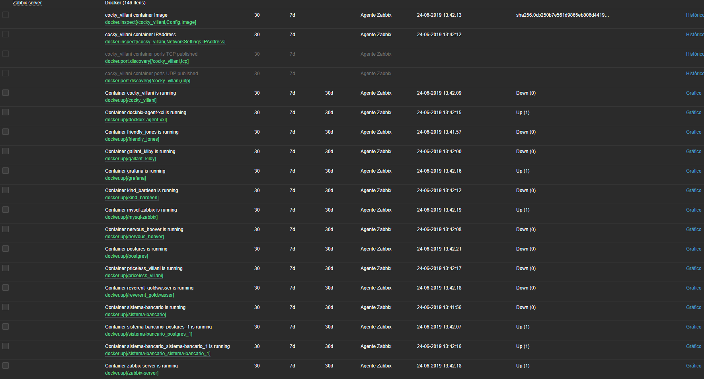
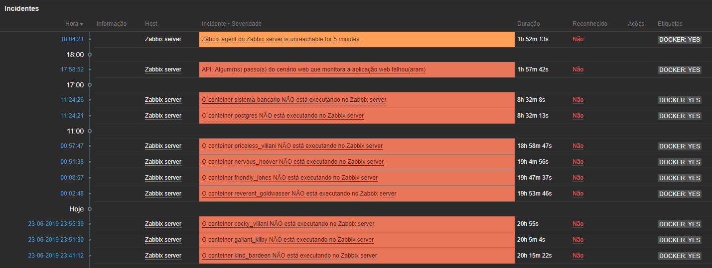
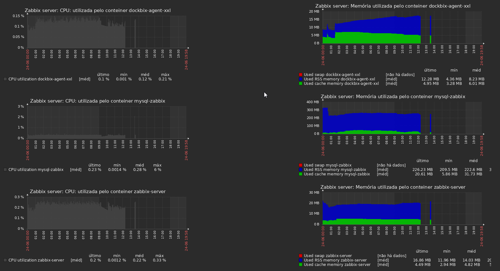
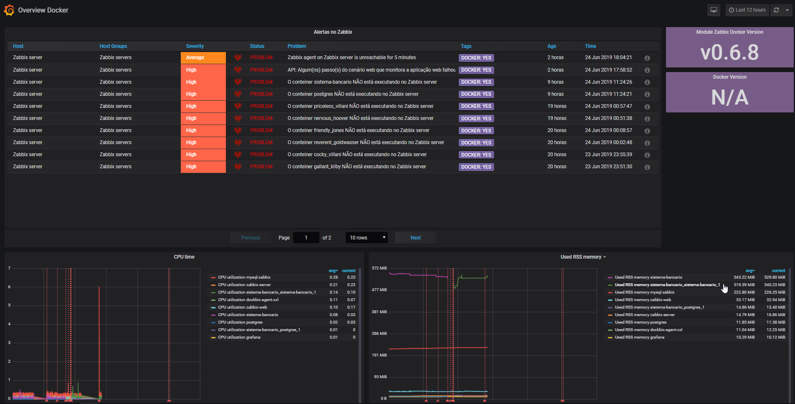

# zabbix_monitoring_docker

# Zabbix

Defina a versão do Zabbix.

```bash
VERSAO_MAIOR_ZABBIX=4.4
```

Crie o diretório para armazenar os dados do banco de dados fora do conteiner.

```bash
sudo mkdir -p /docker/mysql/zabbix/data
```

Obtenha as imagens Docker.

```bash
docker pull mysql:8
docker pull zabbix/zabbix-agent:ubuntu-$VERSAO_MAIOR_ZABBIX-latest
docker pull zabbix/zabbix-proxy-sqlite3:ubuntu-$VERSAO_MAIOR_ZABBIX-latest
docker pull zabbix/zabbix-server-mysql:ubuntu-$VERSAO_MAIOR_ZABBIX-latest
docker pull zabbix/zabbix-web-apache-mysql:ubuntu-$VERSAO_MAIOR_ZABBIX-latest
```

Crie o conteiner do banco de dados.

```bash
docker run -d --name mysql-zabbix \
 --restart always \
 -p 3306:3306 \
 -v /docker/mysql/zabbix/data:/var/lib/mysql \
 -e MYSQL_HOST=172.17.0.1 \
 -e MYSQL_ROOT_PASSWORD=secret \
 -e MYSQL_DATABASE=zabbix \
 -e MYSQL_USER=zabbix \
 -e MYSQL_PASSWORD=zabbix \
mysql:8 --default-authentication-plugin=mysql_native_password
```

Crie o conteiner do Zabbix Server.

```bash
docker run -d --name zabbix-server \
 --restart always \
 -p 10151:10051 \
 -e MYSQL_ROOT_PASSWORD="secret" \
 -e DB_SERVER_HOST="172.17.0.1" \
 -e DB_SERVER_PORT="3306" \
 -e MYSQL_USER="zabbix" \
 -e MYSQL_PASSWORD="zabbix" \
 -e MYSQL_DATABASE="zabbix" \
zabbix/zabbix-server-mysql:ubuntu-$VERSAO_MAIOR_ZABBIX-latest
```

Crie o conteiner do Frontend do Zabbix.

```bash
docker run -d --name zabbix-web \
 --restart always \
 -p 80:80 \
 -e DB_SERVER_HOST="172.17.0.1" \
 -e DB_SERVER_PORT="3306" \
 -e MYSQL_USER="zabbix" \
 -e MYSQL_PASSWORD="zabbix" \
 -e MYSQL_DATABASE="zabbix" \
 -e ZBX_SERVER_HOST="172.17.0.1" \
 -e PHP_TZ="America/Sao_Paulo" \
 -e ZBX_SERVER_PORT="10151" \
zabbix/zabbix-web-apache-mysql:ubuntu-$VERSAO_MAIOR_ZABBIX-latest
```

O Zabbix ficará acessível no URL:

* http://IP-ADDRESS:80
* Login: Admin
* Senha: zabbix

Fonte: 

* http://blog.aeciopires.com/zabbix-docker/

# Grafana

Crie o diretório para armazenar os dados fora do conteiner.

```bash
sudo mkdir -p /docker/grafana/data
sudo chown -R 472:472 /docker/grafana/data
sudo chmod -R 775 /docker/grafana
```

Crie o conteiner do Grafana.

```bash
docker run -d --name=grafana \
 --restart always \
 -p 3000:3000 \
 -e "GF_INSTALL_PLUGINS=grafana-clock-panel,briangann-gauge-panel,alexanderzobnin-zabbix-app" \
 -e "GF_SERVER_PROTOCOL=http" \
 -e "GF_SERVER_HTTP_PORT=3000" \
 -v /docker/grafana/data:/var/lib/grafana \
grafana/grafana
```

O Grafana ficará acessível no URL:

* http://IP-ADDRESS:3000
* Login: admin
* Senha: admin

Fonte: 

* http://blog.aeciopires.com/instalando-o-grafana-via-docker/

# Monitorando conteineres

Crie um conteiner do Zabbix Agent customizado pelo projeto monitoringartist para monitoramento de conteineres Docker.

```bash
docker run -d --name=dockbix-agent-xxl \
  --net=host \
  --hostname "$(hostname)" \
  --privileged \
  -v /:/rootfs \
  -v /var/run:/var/run \
  --restart always \
  -p 10050:10050 \
   -e ZA_Hostname="$(hostname)" \
  -e "ZA_Server=172.17.0.1,server,172.17.0.3" \
  -e "ZA_ServerActive=172.17.0.1,server,172.17.0.3" \
  -e "ZA_ListenPort=10050" \
-d monitoringartist/dockbix-agent-xxl-limited:latest
```

OBS.: ``172.17.0.3`` é o endereço IPv4 do conteiner ``zabbix-server``, que é atribuído dinamicamente via DHCP pelo Docker.

Importe o [Template Docker - ZabbixBR.xml](Template_Docker-ZabbixBR.xml) no Zabbix e associe ao host Zabbix-Server.

Veja algumas imagens do template:

* Dados recentes.



* Incidentes.



* Tela de uso de CPU e memória.




Métricas disponíveis com o uso do módulo ``zabbix_module_docker.so``: https://github.com/monitoringartist/zabbix-docker-monitoring#available-metrics

Importe o dashboard no Grafana: [Overview_Docker.json](Overview_Docker.json)



Fonte:

* https://github.com/monitoringartist/zabbix-docker-monitoring
* https://raw.githubusercontent.com/monitoringartist/zabbix-docker-monitoring/master/template/Zabbix-Template-App-Docker.xml
* https://raw.githubusercontent.com/monitoringartist/grafana-zabbix-dashboards/master/overview-docker/overview-docker.json

## Desenvolvedor

Aécio dos Santos Pires

Site: http://aeciopires.com

## Licença

GPLv3 License
